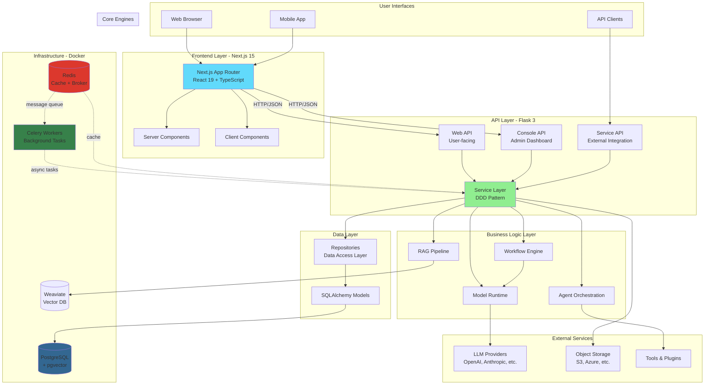
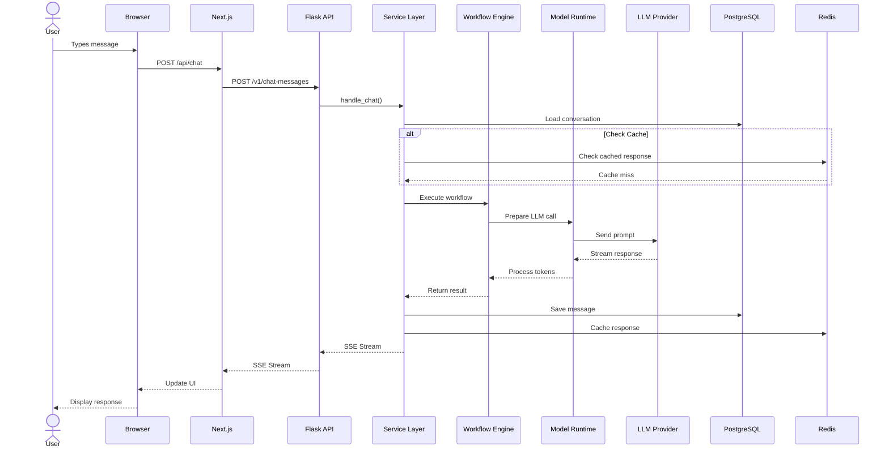
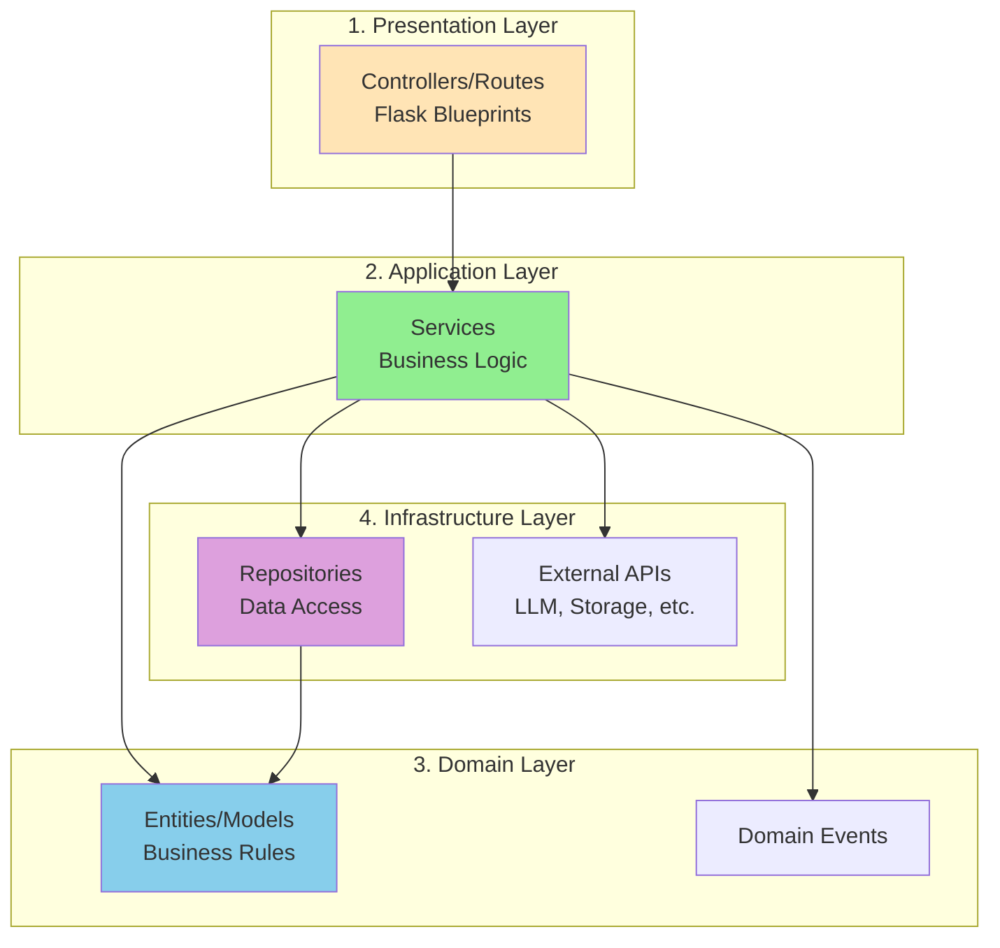
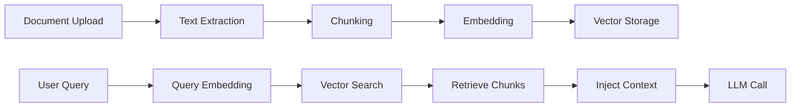
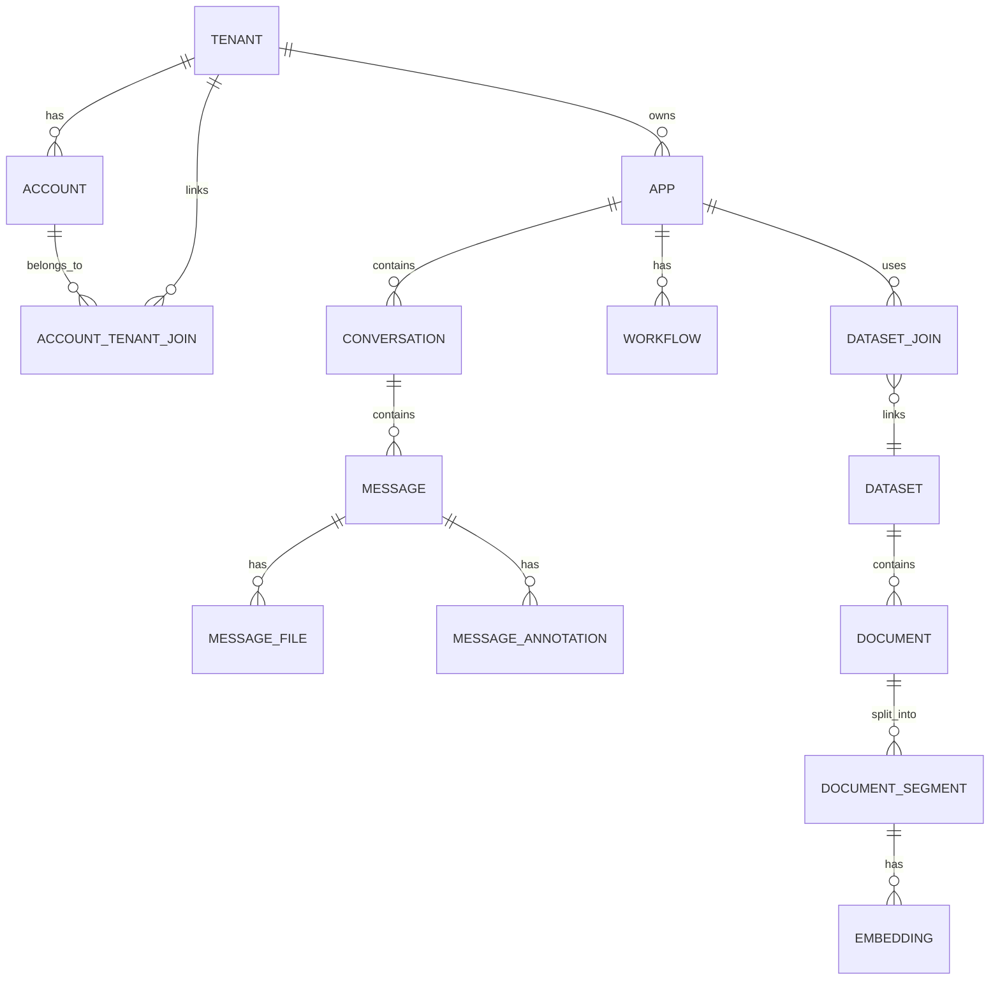
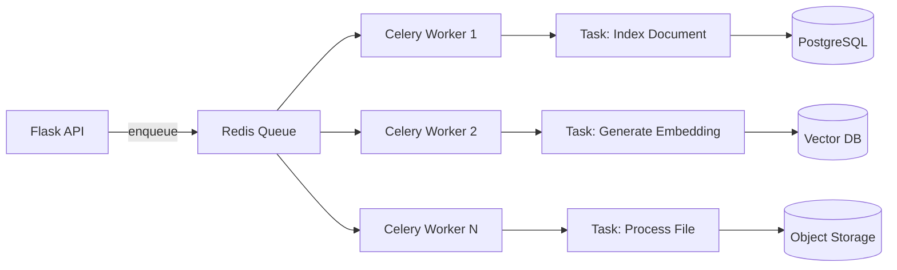
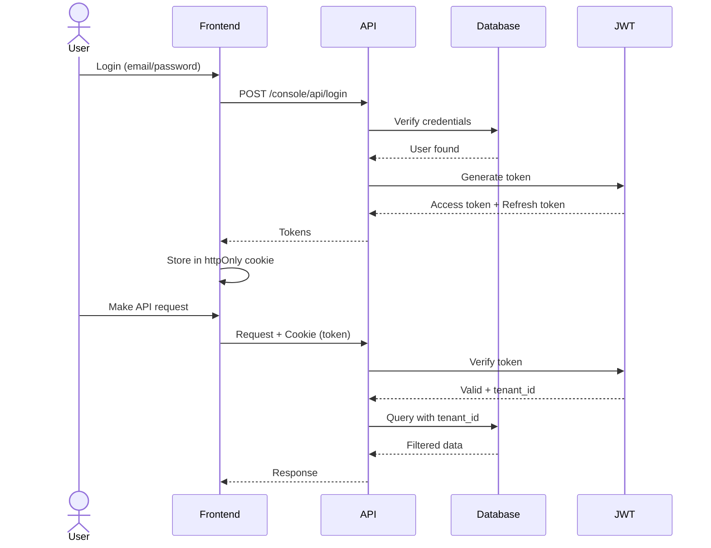
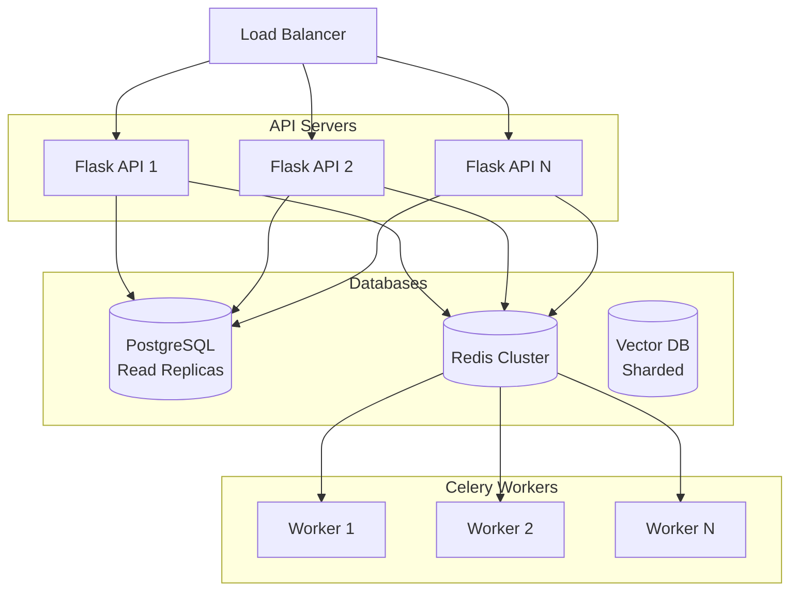

# Architecture Overview

## 🎯 Purpose

This guide provides a high-level understanding of Dify's architecture. By the end, you'll understand:
- How the system components fit together
- The request lifecycle from user to LLM
- Why specific technologies were chosen
- How multi-tenancy works
- The role of each major component

**Time to read:** 60 minutes

---

## 🏗️ System Architecture Diagram

🧠 **Mental Model:** Think of Dify as a **three-layer cake**:
1. **Top Layer (Frontend):** User interface - Next.js/React
2. **Middle Layer (Backend):** Business logic - Flask/Python
3. **Bottom Layer (Data):** Storage - PostgreSQL/Redis/Vector DBs

---

## 🔄 Request Lifecycle

Let's trace a chat message from the user to an LLM response:

💡 **Aha Moment:** The response **streams** back through all layers in real-time! Just like streaming in Node.js, but using Server-Sent Events (SSE).

---

## 🏛️ Clean Architecture Layers

Dify follows **Clean Architecture** principles with clear separation of concerns:

🌉 **Bridge from Node.js:**

| Dify Layer | Node.js Equivalent | Example |
|------------|-------------------|---------|
| Controllers | Express Routes | `app.post('/api/chat', handler)` |
| Services | Service Classes | `ChatService.sendMessage()` |
| Entities | Domain Models | `class Message { ... }` |
| Repositories | Data Access | `MessageRepository.save()` |

🔗 **Code Example:** See [app_service.py](../../api/services/app_service.py#L1-L50) for Service Layer pattern

---

## 🧩 Core Components Explained

### 1. Frontend (Next.js + React)

**Location:** `/web`

**Key Technologies:**
- Next.js 15 (App Router with Server Components)
- React 19 (Server + Client Components)
- Zustand (Global State)
- React Query (Server State)
- React Flow (Workflow Canvas)

**Responsibilities:**
- User interface rendering
- State management
- API communication
- Real-time updates (SSE)

🔗 **Entry Point:** [web/app/layout.tsx](../../web/app/layout.tsx)

🌉 **Bridge from React:** If you've used Create React App or Vite, Next.js App Router is similar but with server-side rendering (SSR) and React Server Components (RSC) for better performance.

### 2. Backend API (Flask)

**Location:** `/api`

**Key Technologies:**
- Flask 3 (Web Framework)
- SQLAlchemy 2 (ORM)
- Pydantic 2 (Validation)
- Celery 5 (Background Tasks)

**Responsibilities:**
- Request handling
- Business logic orchestration
- Authentication/Authorization
- Database operations
- Task scheduling

🔗 **Entry Point:** [api/app.py](../../api/app.py#L23-L29)

### 3. Workflow Engine

**Location:** `/api/core/workflow`

The workflow engine is Dify's visual programming system for LLM applications.

**Key Features:**
- Node-based execution graph
- Variable passing between nodes
- Conditional logic
- Error handling
- Streaming support

🔗 **Core Engine:** [api/core/workflow/graph_engine/graph_engine.py](../../api/core/workflow/graph_engine/graph_engine.py)

🧠 **Mental Model:** Think of it like **Zapier or n8n** - visual automation for LLM calls.

### 4. RAG Pipeline

**Location:** `/api/core/rag`

The RAG (Retrieval-Augmented Generation) pipeline handles:
1. Document ingestion and chunking
2. Embedding generation
3. Vector storage
4. Semantic search
5. Context injection

🔗 **Pipeline Code:** [api/core/rag/retrieval/dataset_retrieval.py](../../api/core/rag/retrieval/dataset_retrieval.py)

### 5. Agent Orchestration

**Location:** `/api/core/agent`

Handles autonomous agents that can:
- Call tools/functions
- Make decisions
- Chain multiple LLM calls
- React to results

🔗 **Agent Runner:** [api/core/agent/agent_runner.py](../../api/core/agent/agent_runner.py)

🌉 **Bridge:** Similar to **LangChain agents** or **AutoGPT** - autonomous task execution.

### 6. Model Runtime

**Location:** `/api/core/model_runtime`

Abstraction layer for LLM providers:
- OpenAI (GPT-4, GPT-3.5)
- Anthropic (Claude)
- Google (Gemini, PaLM)
- Azure OpenAI
- Open-source models (via Ollama, vLLM)

🔗 **Runtime Interface:** [api/core/model_runtime/model_providers](../../api/core/model_runtime/model_providers)

💡 **Aha Moment:** One interface, 50+ LLM providers! Switch models without changing code.

---

## 🗄️ Data Architecture

### Database Schema Overview

🔗 **Models:** [api/models/\__init\_\_.py](../../api/models/__init__.py#L1-L50)

### Multi-Tenancy Model

Dify is **multi-tenant from day one**. Each tenant has isolated:
- Apps
- Conversations
- Datasets
- API keys

**Tenant Isolation:**
- All queries filter by `tenant_id`
- Row-level security
- Separate API tokens per tenant

🔗 **Tenant Model:** [api/models/account.py](../../api/models/account.py)

🌉 **Bridge:** Like Slack workspaces or GitHub organizations - each tenant is completely isolated.

---

## ⚡ Async Architecture (Celery)

Dify uses Celery for long-running tasks:

**Common async tasks:**
- Document indexing
- Embedding generation
- File processing
- Batch operations
- Scheduled jobs

🔗 **Task Definitions:** [api/tasks/](../../api/tasks/)

🌉 **Bridge from Node.js:**

| Python (Dify) | Node.js Equivalent |
|---------------|-------------------|
| Celery | Bull, BullMQ |
| Redis broker | Redis queue |
| Celery worker | Worker process |
| Task | Job |

---

## 🔐 Authentication & Authorization

### Authentication Flow

🔗 **Auth Service:** [api/controllers/console/auth/login.py](../../api/controllers/console/auth/login.py)

⚠️ **Common Pitfall:** Always filter by `tenant_id` in queries to prevent cross-tenant data leaks!

---

## 🎨 Why These Technologies?

### Why Flask instead of FastAPI or Express?

**Flask Pros:**
- ✅ Mature ecosystem (15+ years)
- ✅ Flexible and unopinionated
- ✅ Great ORM support (SQLAlchemy)
- ✅ Extensive extensions
- ✅ Large community

**FastAPI would be great for:**
- ❌ Full async/await (but Dify uses Celery for async)
- ❌ Auto-generated API docs (Dify has custom docs)

### Why Next.js App Router instead of Pages Router?

**App Router Pros:**
- ✅ React Server Components (better performance)
- ✅ Streaming SSR
- ✅ Improved layouts
- ✅ Better TypeScript support
- ✅ Future of Next.js

### Why SQLAlchemy instead of raw SQL?

**SQLAlchemy Pros:**
- ✅ Type safety
- ✅ Relationship management
- ✅ Migration support
- ✅ Multi-database support
- ✅ Query builder (like Prisma in Node.js)

### Why Celery instead of just async/await?

**Celery Pros:**
- ✅ Distributed task queue
- ✅ Retry logic
- ✅ Task scheduling
- ✅ Result backend
- ✅ Scalability (multiple workers)

🌉 **Bridge:** Celery is to Python what **BullMQ** is to Node.js - persistent, distributed task queues.

---

## 🚀 Scalability Considerations

### Horizontal Scaling

**Scaling strategies:**
1. **Frontend:** Edge deployment (Vercel, Cloudflare)
2. **API:** Horizontal scaling (multiple Flask processes)
3. **Celery:** Add more workers
4. **Database:** Read replicas + connection pooling
5. **Redis:** Redis Cluster
6. **Vector DB:** Sharding by tenant

---

## 🔍 Observability

Dify includes built-in observability:

**Tracing:** OpenTelemetry
- Request tracing
- LLM call tracking
- Performance monitoring

**Error Tracking:** Sentry
- Frontend errors
- Backend exceptions
- User impact analysis

**Logging:** Structured logging
- JSON logs
- Log levels
- Correlation IDs

🔗 **Observability Config:** [api/configs/observability/](../../api/configs/observability/)

---

## ✅ Quick Check

Test your understanding:

1. **Q:** What are the three main layers of Dify's architecture?
   

   
Answer

   Frontend (Next.js), Backend API (Flask), Data Layer (PostgreSQL/Redis)
   

2. **Q:** What is Celery used for?
   

   
Answer

   Asynchronous background task processing (like document indexing, embeddings)
   

3. **Q:** How does Dify achieve multi-tenancy?
   

   
Answer

   Row-level filtering by tenant_id in all database queries
   

4. **Q:** What pattern does the backend follow for organization?
   

   
Answer

   Domain-Driven Design (DDD) with Clean Architecture
   

5. **Q:** What's the difference between the Console API and Service API?
   

   
Answer

   Console API is for admin dashboard, Service API is for external integrations
   

---

## 🎯 Key Takeaways

🧠 **Remember This (SCALRWM):**
- **S**ervice layer orchestrates business logic
- **C**lean architecture separates concerns
- **A**sync tasks use Celery
- **L**LM providers abstracted by Model Runtime
- **R**AG pipeline handles retrieval
- **W**orkflow engine executes graphs
- **M**ulti-tenant by design

---

## 📚 Next Steps

Now that you understand the architecture:

1. **[Project Structure](./PROJECT_STRUCTURE.md)** - Where to find specific code
2. **[Tech Stack Guide](./TECH_STACK_GUIDE.md)** - Deep dive into each technology
3. **[Data Flow Guide](./DATA_FLOW_GUIDE.md)** - Follow requests through the system

Or dive into specific areas:

4. **[Frontend Architecture](./FRONTEND_ARCHITECTURE.md)** - Next.js deep dive
5. **[Backend Architecture](./BACKEND_ARCHITECTURE.md)** - Flask/DDD patterns
6. **[Database Architecture](./DATABASE_ARCHITECTURE.md)** - Schema and models

---

## 🔗 Related Documentation

- [Flask Documentation](https://flask.palletsprojects.com/)
- [Next.js App Router](https://nextjs.org/docs/app)
- [SQLAlchemy ORM](https://docs.sqlalchemy.org/)
- [Celery Documentation](https://docs.celeryq.dev/)
- [Clean Architecture by Uncle Bob](https://blog.cleancoder.com/uncle-bob/2012/08/13/the-clean-architecture.html)

---

*Understanding architecture is the foundation of effective contribution!*
