# Data Flow Guide

## 🎯 Purpose

This guide traces **actual data flows** through Dify. By following real requests end-to-end, you'll understand:
- How user actions become API calls
- How the backend processes requests
- How data moves between layers
- How async tasks work
- How LLM responses stream back

**Time to read:** 2 hours

---

## 📋 Table of Contents

1. [Chat Message Flow](#1-chat-message-flow)
2. [Document Upload and Indexing](#2-document-upload-and-indexing)
3. [Workflow Execution](#3-workflow-execution)
4. [User Authentication](#4-user-authentication)
5. [RAG Retrieval Flow](#5-rag-retrieval-flow)
6. [WebSocket Real-time Updates](#6-websocket-real-time-updates)

---

## 1. Chat Message Flow

**User Action:** User types a message in the chat interface.

**End Result:** AI response appears, streaming token by token.

### Sequence Diagram


### Code Path

**Frontend (Next.js):**

1. **User Input Component**
   ```typescript
   // web/app/components/base/chat/chat/input.tsx
   const handleSend = async () => {
     const response = await fetch('/api/chat-messages', {
       method: 'POST',
       body: JSON.stringify({ query, conversation_id }),
     })

     const reader = response.body.getReader()
     // Stream processing...
   }
   ```
   🔗 [web/app/components/base/chat/chat/answer/index.tsx](../../web/app/components/base/chat/chat/answer/index.tsx)

2. **API Client**
   ```typescript
   // web/service/conversations.ts
   export const sendChatMessage = (
     body: ChatMessageRequest
   ): Promise<Response> => {
     return post<Response>('/chat-messages', { body })
   }
   ```
   🔗 [web/service/conversations.ts](../../web/service/conversations.ts)

**Backend (Flask):**

3. **Controller (Flask Blueprint)**
   ```python
   # api/controllers/web/message.py
   @bp.route('/chat-messages', methods=['POST'])
   def create_chat_message():
       parser = reqparse.RequestParser()
       parser.add_argument('query', type=str, required=True)
       parser.add_argument('conversation_id', type=str)
       args = parser.parse_args()

       return MessageService.create_message(
           app_model=app_model,
           user=end_user,
           args=args,
       )
   ```
   🔗 [api/controllers/web/message.py](../../api/controllers/web/message.py)

4. **Service Layer**
   ```python
   # api/services/message_service.py
   class MessageService:
       @staticmethod
       def create_message(app_model, user, args):
           # Load conversation
           conversation = ConversationService.get_conversation(...)

           # Create user message
           message = Message(
               app_id=app_model.id,
               conversation_id=conversation.id,
               role='user',
               content=args['query'],
           )
           db.session.add(message)
           db.session.flush()

           # Execute workflow
           response_generator = AppRunner.run(
               app_model=app_model,
               query=args['query'],
               conversation=conversation,
           )

           # Stream response
           return Response(
               stream_generator(response_generator),
               mimetype='text/event-stream',
           )
   ```
   🔗 [api/services/message_service.py](../../api/services/message_service.py)

5. **Workflow Engine**
   ```python
   # api/core/workflow/graph_engine/graph_engine.py
   class GraphEngine:
       def run(self):
           # Build execution graph
           graph = self._build_graph()

           # Execute nodes
           for node in graph.topological_sort():
               result = self._run_node(node)
               yield result  # Stream results
   ```
   🔗 [api/core/workflow/graph_engine/graph_engine.py](../../api/core/workflow/graph_engine/graph_engine.py)

6. **Model Runtime**
   ```python
   # api/core/model_runtime/model_providers/openai/llm.py
   def invoke(self, prompt: str, stream: bool = True):
       response = openai.ChatCompletion.create(
           model=self.model,
           messages=[{"role": "user", "content": prompt}],
           stream=stream,
       )

       if stream:
           for chunk in response:
               yield chunk.choices[0].delta.content
       else:
           return response.choices[0].message.content
   ```
   🔗 [api/core/model_runtime/](../../api/core/model_runtime/)

### Key Observations

💡 **Streaming:** Response streams through **all layers** without buffering!

```
OpenAI → ModelRuntime → Workflow → Service → Flask → Next.js → Browser → User
   ↓         ↓           ↓          ↓        ↓       ↓        ↓        ↓
 token    yield       yield      yield    SSE     SSE      UI    Display
```

🧠 **Mental Model:** Think of it as a **pipeline** where each layer is a **transform stream**.

---

## 2. Document Upload and Indexing

**User Action:** User uploads a PDF document to a dataset.

**End Result:** Document is indexed, embeddings stored in vector database.

### Sequence Diagram


### Code Path

**Upload:**

```python
# api/controllers/console/datasets/documents.py
@bp.route('/datasets/<uuid:dataset_id>/documents', methods=['POST'])
def create_document(dataset_id):
    file = request.files['file']

    # Upload to storage
    file_info = FileService.upload_file(
        file=file,
        tenant_id=current_user.current_tenant_id,
    )

    # Create document record
    document = Document(
        dataset_id=dataset_id,
        name=file.filename,
        file_id=file_info.id,
        status='indexing',
    )
    db.session.add(document)
    db.session.commit()

    # Queue indexing task
    from tasks.rag_pipeline import index_document_task
    index_document_task.delay(document.id)

    return {'document_id': document.id, 'status': 'indexing'}
```

🔗 [api/controllers/console/datasets/documents.py](../../api/controllers/console/datasets/documents.py)

**Celery Task:**

```python
# api/tasks/rag_pipeline/index_processor.py
from celery import shared_task

@shared_task(bind=True)
def index_document_task(self, document_id: str):
    document = Document.query.get(document_id)

    # Load file from storage
    file_content = FileService.download_file(document.file_id)

    # Extract text
    text_extractor = get_extractor(document.file_type)
    text = text_extractor.extract(file_content)

    # Split into chunks
    splitter = RecursiveCharacterTextSplitter(
        chunk_size=800,
        chunk_overlap=100,
    )
    chunks = splitter.split_text(text)

    # Process each chunk
    for i, chunk in enumerate(chunks):
        # Create segment
        segment = DocumentSegment(
            document_id=document.id,
            content=chunk,
            position=i,
            word_count=len(chunk.split()),
        )
        db.session.add(segment)
        db.session.flush()

        # Generate embedding
        embedding_service = get_embedding_service()
        embedding_vector = embedding_service.embed_text(chunk)

        # Store in vector DB
        vector_service = get_vector_service()
        vector_service.insert(
            collection=f"dataset_{document.dataset_id}",
            id=segment.id,
            vector=embedding_vector,
            metadata={"content": chunk},
        )

        # Update progress
        progress = int((i + 1) / len(chunks) * 100)
        self.update_state(
            state='PROGRESS',
            meta={'progress': progress},
        )

    # Mark complete
    document.status = 'completed'
    db.session.commit()
```

🔗 [api/tasks/rag_pipeline/](../../api/tasks/rag_pipeline/)

### Key Observations

🎯 **Two-Phase Process:**
1. **Synchronous:** Upload file, create record, queue task → 202 response
2. **Asynchronous:** Process file, generate embeddings, store vectors

🌉 **Bridge from Node.js:** Same pattern as file upload + BullMQ job.

```typescript
// Express + BullMQ equivalent
app.post('/documents', async (req, res) => {
  const file = await uploadFile(req.file)
  const document = await Document.create({ fileId: file.id })

  // Queue async task
  await documentQueue.add('index', { documentId: document.id })

  res.status(202).json({ documentId: document.id, status: 'indexing' })
})
```

---

## 3. Workflow Execution

**User Action:** User clicks "Run" on a workflow.

**End Result:** Workflow executes, nodes run in order, variables flow between nodes.

### Simplified Flow


### Execution Diagram


### Code Path

```python
# api/core/workflow/graph_engine/graph_engine.py
class GraphEngine:
    def run(
        self,
        workflow: Workflow,
        inputs: dict[str, Any],
    ):
        # Build execution graph
        graph = self._build_graph(workflow)

        # Variable pool for passing data between nodes
        variable_pool = VariablePool()
        variable_pool.add_variables(inputs)

        # Topological sort (dependency order)
        execution_order = graph.topological_sort()

        # Execute each node in order
        for node in execution_order:
            # Get input variables for this node
            node_inputs = self._get_node_inputs(node, variable_pool)

            # Run the node
            node_instance = self._create_node_instance(node)
            node_output = node_instance.run(node_inputs)

            # Add output to variable pool
            variable_pool.add_variables(node_output)

            # Yield progress (for streaming)
            yield {
                'event': 'node_finished',
                'node_id': node.id,
                'output': node_output,
            }

        # Workflow complete
        yield {
            'event': 'workflow_finished',
            'outputs': variable_pool.get_outputs(),
        }
```

🔗 [api/core/workflow/graph_engine/graph_engine.py](../../api/core/workflow/graph_engine/graph_engine.py)

**Node Implementation Example:**

```python
# api/core/workflow/nodes/llm.py
class LLMNode(BaseNode):
    def run(self, inputs: dict) -> dict:
        # Build prompt from template + variables
        prompt = self.config['prompt_template'].format(**inputs)

        # Call LLM
        model_runtime = get_model_runtime(self.config['model'])
        response = model_runtime.invoke(
            prompt=prompt,
            stream=False,
        )

        return {
            'output': response,
        }
```

🔗 [api/core/workflow/nodes/](../../api/core/workflow/nodes/)

### Key Observations

🧠 **Mental Model:** Workflow = **DAG (Directed Acyclic Graph)** where:
- Nodes = functions
- Edges = data flow
- Variables = shared state

💡 **Aha Moment:** It's like Redux middleware chain or Express middleware, but with a visual graph!

---

## 4. User Authentication

**User Action:** User logs in with email/password.

**End Result:** JWT token stored in httpOnly cookie.

### Authentication Flow

```mermaid
sequenceDiagram
    actor User
    participant Browser
    participant Next.js
    participant Flask
    participant AuthService
    participant PostgreSQL
    participant JWT

    User->>Browser: Enter email/password
    Browser->>Next.js: Submit form
    Next.js->>Flask: POST /console/api/login<br/>{email, password}

    Flask->>AuthService: authenticate(email, password)
    AuthService->>PostgreSQL: SELECT * FROM accounts<br/>WHERE email=?
    PostgreSQL-->>AuthService: Account row

    AuthService->>AuthService: Verify password hash<br/>(bcrypt.checkpw)

    alt Invalid password
        AuthService-->>Flask: Raise Unauthorized
        Flask-->>Next.js: 401 Unauthorized
        Next.js-->>Browser: Show error
    end

    AuthService->>PostgreSQL: SELECT * FROM tenant_account_joins<br/>WHERE account_id=?
    PostgreSQL-->>AuthService: Tenant associations

    AuthService->>JWT: Generate access token<br/>{user_id, tenant_id, exp: 7d}
    JWT-->>AuthService: access_token

    AuthService->>JWT: Generate refresh token<br/>{user_id, exp: 30d}
    JWT-->>AuthService: refresh_token

    AuthService-->>Flask: {access_token, refresh_token, user}
    Flask-->>Next.js: Set-Cookie: access_token=...; HttpOnly<br/>Set-Cookie: refresh_token=...; HttpOnly<br/>{user}
    Next.js->>Next.js: Store user in state
    Next.js-->>Browser: Redirect to /apps
    Browser-->>User: Show apps page
```

### Code Path

**Login Controller:**

```python
# api/controllers/console/auth/login.py
@bp.route('/login', methods=['POST'])
def login():
    parser = reqparse.RequestParser()
    parser.add_argument('email', type=str, required=True)
    parser.add_argument('password', type=str, required=True)
    args = parser.parse_args()

    # Authenticate
    account = AccountService.authenticate(
        email=args['email'],
        password=args['password'],
    )

    # Generate tokens
    tokens = TokenManager.generate_tokens(account)

    # Set httpOnly cookies
    response = make_response(jsonify({
        'user': account.to_dict(),
    }))
    response.set_cookie(
        'access_token',
        tokens['access_token'],
        httponly=True,
        secure=True,
        samesite='Lax',
        max_age=7 * 24 * 60 * 60,  # 7 days
    )
    response.set_cookie(
        'refresh_token',
        tokens['refresh_token'],
        httponly=True,
        secure=True,
        samesite='Lax',
        max_age=30 * 24 * 60 * 60,  # 30 days
    )

    return response
```

🔗 [api/controllers/console/auth/login.py](../../api/controllers/console/auth/login.py)

**Subsequent Requests:**

```python
# api/extensions/auth_middleware.py
def require_auth(f):
    @wraps(f)
    def decorated(*args, **kwargs):
        # Get token from cookie
        token = request.cookies.get('access_token')
        if not token:
            raise Unauthorized()

        # Verify and decode
        try:
            payload = jwt.decode(
                token,
                current_app.config['SECRET_KEY'],
                algorithms=['HS256'],
            )
        except jwt.ExpiredSignatureError:
            raise Unauthorized('Token expired')
        except jwt.InvalidTokenError:
            raise Unauthorized('Invalid token')

        # Load user and tenant
        account = Account.query.get(payload['user_id'])
        tenant = Tenant.query.get(payload['tenant_id'])

        # Store in request context
        g.current_user = account
        g.current_tenant = tenant

        return f(*args, **kwargs)

    return decorated

# Usage
@bp.route('/apps')
@require_auth
def get_apps():
    # g.current_user and g.current_tenant available
    apps = App.query.filter_by(tenant_id=g.current_tenant.id).all()
    return jsonify([app.to_dict() for app in apps])
```

### Key Observations

🔐 **Security:**
- Passwords hashed with bcrypt
- JWT tokens in httpOnly cookies (not localStorage!)
- CSRF protection via SameSite cookies
- Tokens expire (access: 7d, refresh: 30d)

🌉 **Bridge from Node.js:** Same JWT pattern as Passport.js or NextAuth.

---

## 5. RAG Retrieval Flow

**User Action:** User asks a question that requires knowledge base context.

**End Result:** Relevant documents retrieved, context injected into LLM prompt.

### RAG Flow Diagram


### Code Path

**RAG Retrieval:**

```python
# api/core/rag/retrieval/dataset_retrieval.py
class DatasetRetrieval:
    def retrieve(
        self,
        dataset_ids: list[str],
        query: str,
        top_k: int = 3,
    ) -> list[DocumentSegment]:
        # Generate query embedding
        embedding_service = get_embedding_service()
        query_vector = embedding_service.embed_text(query)

        # Search in vector DB
        vector_service = get_vector_service()
        results = []

        for dataset_id in dataset_ids:
            collection_name = f"dataset_{dataset_id}"
            search_results = vector_service.search(
                collection=collection_name,
                query_vector=query_vector,
                top_k=top_k,
            )
            results.extend(search_results)

        # Rerank if configured
        if self.rerank_enabled:
            results = self._rerank(query, results)

        # Return top K overall
        results.sort(key=lambda x: x.score, reverse=True)
        return results[:top_k]

    def _rerank(self, query: str, results: list) -> list:
        # Use reranker model (e.g., Cohere, Jina)
        reranker = get_reranker_service()
        scores = reranker.rank(
            query=query,
            documents=[r.content for r in results],
        )

        # Update scores
        for result, score in zip(results, scores):
            result.rerank_score = score

        return results
```

🔗 [api/core/rag/retrieval/dataset_retrieval.py](../../api/core/rag/retrieval/dataset_retrieval.py)

**Prompt Building:**

```python
# api/core/prompt/prompt_builder.py
class PromptBuilder:
    def build_rag_prompt(
        self,
        query: str,
        retrieved_contexts: list[str],
        template: str,
    ) -> str:
        # Format context
        context_text = "\n\n".join([
            f"[{i+1}] {ctx}"
            for i, ctx in enumerate(retrieved_contexts)
        ])

        # Inject into template
        prompt = template.format(
            context=context_text,
            question=query,
        )

        return prompt

# Template example:
"""
You are a helpful assistant. Use the following context to answer the question.

Context:
{context}

Question: {question}

Answer:
"""
```

### Key Observations

🧠 **Mental Model:** RAG = **Search → Retrieve → Augment**

```
Query → Embedding → Vector Search → Top K Docs → Inject → LLM → Answer
```

💡 **Aha Moment:** Vector search is like **fuzzy semantic search** - finds similar meaning, not just keywords!

---

## 6. WebSocket Real-time Updates

**User Action:** Document indexing progress updates in real-time.

**End Result:** Progress bar updates without polling.

### WebSocket Flow

```mermaid
sequenceDiagram
    participant Browser
    participant WebSocket
    participant Flask
    participant Redis PubSub
    participant Celery Worker

    Browser->>WebSocket: Connect ws://localhost:5001/sse
    WebSocket->>Flask: Upgrade to WebSocket
    Flask->>Redis PubSub: SUBSCRIBE progress_channel

    Note over Celery Worker: Indexing document...

    Celery Worker->>Redis PubSub: PUBLISH progress_channel<br/>{document_id: 'abc', progress: 25%}

    Redis PubSub-->>Flask: Message received
    Flask-->>WebSocket: Send {progress: 25%}
    WebSocket-->>Browser: onmessage event
    Browser->>Browser: Update progress bar (25%)

    Celery Worker->>Redis PubSub: PUBLISH progress_channel<br/>{document_id: 'abc', progress: 50%}
    Redis PubSub-->>Flask: Message received
    Flask-->>WebSocket: Send {progress: 50%}
    WebSocket-->>Browser: onmessage event
    Browser->>Browser: Update progress bar (50%)

    Celery Worker->>Redis PubSub: PUBLISH progress_channel<br/>{document_id: 'abc', progress: 100%}
    Redis PubSub-->>Flask: Message received
    Flask-->>WebSocket: Send {progress: 100%, status: 'completed'}
    WebSocket-->>Browser: onmessage event
    Browser->>Browser: Show "Complete!" ✓
```



### Code Path

**Backend (Publisher):**

```python
# api/tasks/rag_pipeline/index_processor.py
@shared_task(bind=True)
def index_document_task(self, document_id: str):
    redis_client = get_redis_client()

    for i, chunk in enumerate(chunks):
        # Process chunk...

        # Publish progress
        progress = int((i + 1) / len(chunks) * 100)
        redis_client.publish(
            f'document_progress:{document_id}',
            json.dumps({
                'document_id': document_id,
                'progress': progress,
                'status': 'indexing',
            })
        )

    # Final completion message
    redis_client.publish(
        f'document_progress:{document_id}',
        json.dumps({
            'document_id': document_id,
            'progress': 100,
            'status': 'completed',
        })
    )
```

**Backend (Subscriber):**

```python
# api/controllers/common/sse.py
@bp.route('/sse')
def sse_stream():
    document_id = request.args.get('document_id')

    def event_stream():
        redis_client = get_redis_client()
        pubsub = redis_client.pubsub()
        pubsub.subscribe(f'document_progress:{document_id}')

        for message in pubsub.listen():
            if message['type'] == 'message':
                data = message['data']
                yield f"data: {data}\n\n"

    return Response(
        event_stream(),
        mimetype='text/event-stream',
    )
```

**Frontend (Consumer):**

```typescript
// web/hooks/use-document-progress.ts
export const useDocumentProgress = (documentId: string) => {
  const [progress, setProgress] = useState(0)

  useEffect(() => {
    const eventSource = new EventSource(
      `/api/sse?document_id=${documentId}`
    )

    eventSource.onmessage = (event) => {
      const data = JSON.parse(event.data)
      setProgress(data.progress)

      if (data.status === 'completed') {
        eventSource.close()
      }
    }

    return () => eventSource.close()
  }, [documentId])

  return { progress }
}
```

---

## ✅ Quick Check

1. **Q:** How does a chat message stream from LLM to user?
   <details><summary>Answer</summary>OpenAI → Model Runtime → Workflow → Service → Flask (SSE) → Next.js → Browser</details>

2. **Q:** What triggers async document indexing?
   <details><summary>Answer</summary>Celery task queued after file upload</details>

3. **Q:** How do workflows pass data between nodes?
   <details><summary>Answer</summary>Variable pool that accumulates outputs from each node</details>

4. **Q:** Where are JWT tokens stored in Dify?
   <details><summary>Answer</summary>HttpOnly cookies (not localStorage)</details>

5. **Q:** What's the first step in RAG retrieval?
   <details><summary>Answer</summary>Generate embedding for the user's query</details>

---

## 🎯 Key Takeaways

🧠 **Data Flow Patterns (SARVE):**
- **S**treaming: LLM responses stream through all layers
- **A**sync: Long tasks (indexing) use Celery
- **R**AG: Query → Embed → Search → Retrieve → Augment
- **V**ariables: Workflows pass data via variable pool
- **E**vents: Real-time updates via Redis Pub/Sub + SSE

---

## 📚 Next Steps

Now that you understand data flows:

1. **[Frontend Architecture](./FRONTEND_ARCHITECTURE.md)** - Next.js patterns
2. **[Backend Architecture](./BACKEND_ARCHITECTURE.md)** - Flask/DDD patterns
3. **[Code Tours](./CODE_TOURS.md)** - Follow real code paths
4. **[How-To Guide](./HOW_TO_GUIDE.md)** - Build your own features

---

*Understanding data flow is the key to debugging and extending Dify!* 🔄
